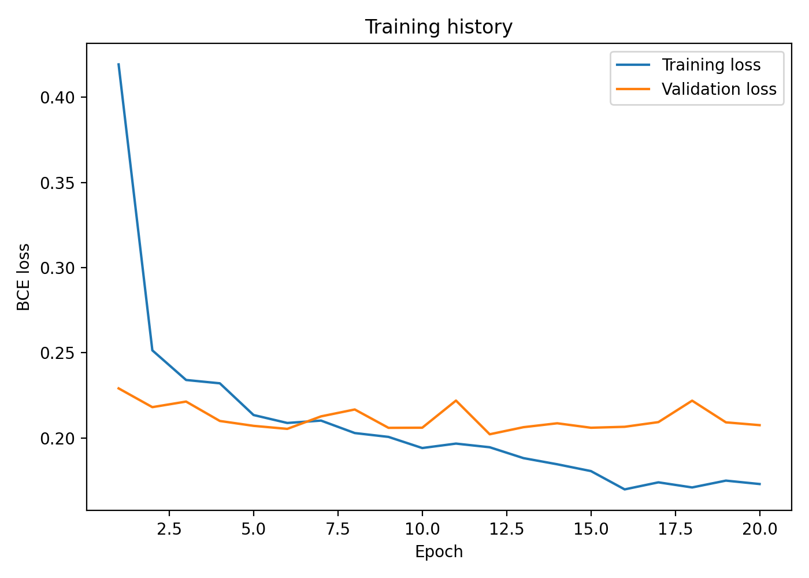
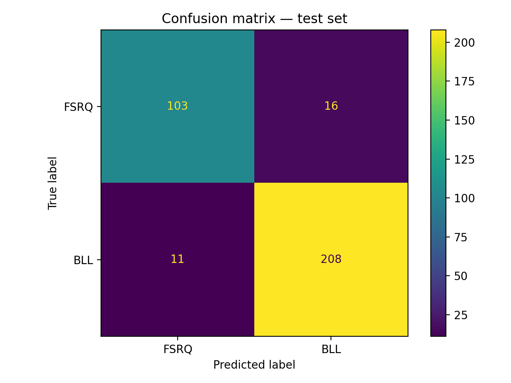
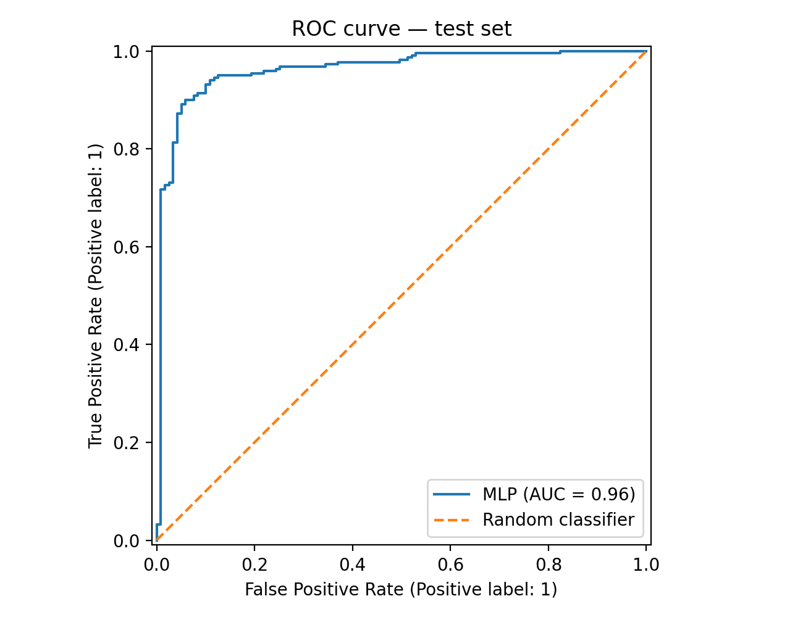
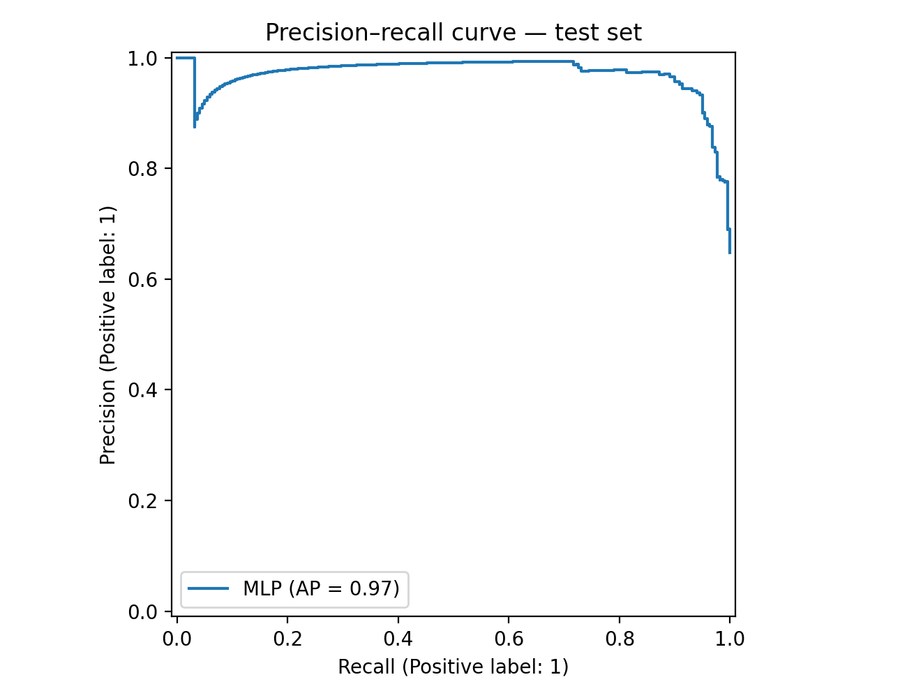
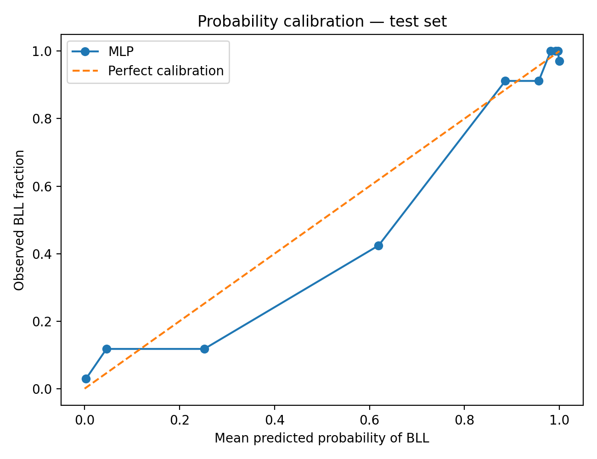
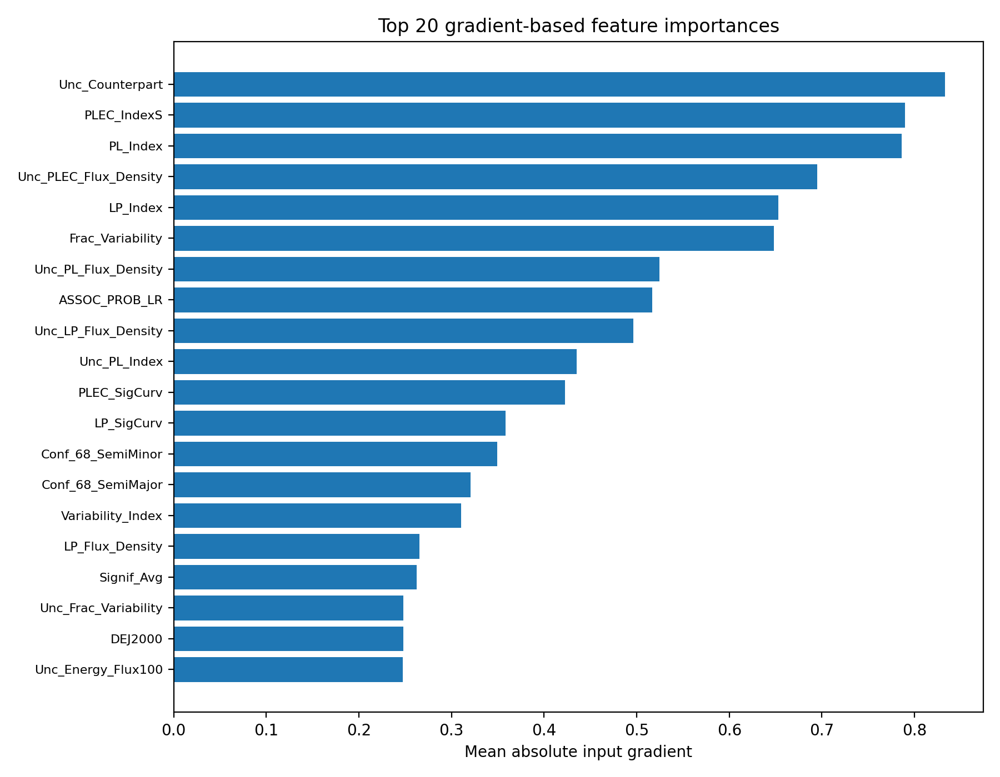
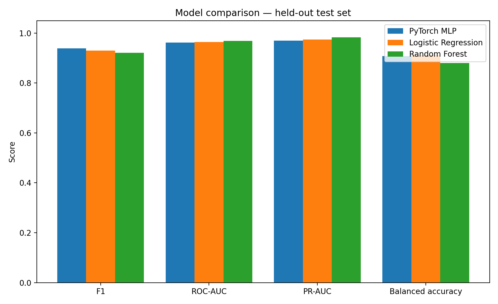
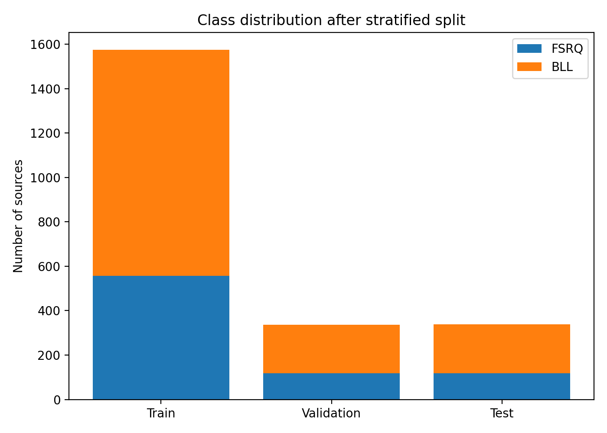

# Fermi-LAT Blazar Classification

A scientific machine-learning project for classifying **blazars** from the Fermi-LAT 4FGL-DR3 catalog as either **BL Lacertae objects (BLL)** or **flat-spectrum radio quasars (FSRQ)**, followed by classification of **blazar candidates of uncertain type (BCU)**.

The project combines astrophysical catalog data with a reproducible supervised-learning pipeline built with PyTorch and scikit-learn.

## Overview

Blazars are active galactic nuclei whose relativistic jets are oriented close to the observer's line of sight. Two of their major subclasses are:

- **BL Lacertae objects (BLL)**
- **Flat-Spectrum Radio Quasars (FSRQ)**

The Fermi-LAT catalogs also contain many sources classified as **BCUs — Blazar Candidates of Uncertain type**.

This project trains machine-learning models using catalog sources with established BLL/FSRQ classifications and then applies the trained classifier to BCU sources.

The workflow was originally developed as an exploratory Jupyter/Colab analysis and later refactored into a modular, reproducible Python project.

## Scientific motivation

The project is inspired by the analysis and source-classification discussion in:

**S. Abdollahi et al. (2022),  
“Incremental Fermi Large Area Telescope Fourth Source Catalog”,  
The Astrophysical Journal Supplement Series, 260, 53.**

DOI: `10.3847/1538-4365/ac6751`

Paper:

https://iopscience.iop.org/article/10.3847/1538-4365/ac6751

In particular, the work is motivated by the presence of a substantial population of gamma-ray sources whose astrophysical class is uncertain and by the possibility of using catalog-level spectral and variability properties to distinguish BLL and FSRQ populations.

The machine-learning implementation in this repository is an independent project and is **not an official Fermi-LAT classification product**.

## Dataset

The project uses the **Fermi-LAT 4FGL-DR3 source catalog**, an incremental version of the Fourth Fermi-LAT Source Catalog based on 12 years of observations.

Catalog download:

https://fermi.gsfc.nasa.gov/ssc/data/access/lat/12yr_catalog/

The expected catalog file is:

```text
data/gll_psc_v31.fit
```

The FITS catalog itself is intentionally excluded from Git because it is an externally maintained scientific dataset.

## Classification task

The supervised binary classification task uses the following convention:

```text
0 → FSRQ
1 → BLL
```

Sources labeled as BCU are kept entirely outside supervised training and are classified only after model selection and evaluation.

## Pipeline

```text
Fermi-LAT 4FGL-DR3 FITS catalog
                │
                ▼
       Source class filtering
        BLL / FSRQ / BCU
                │
                ▼
      Numeric feature selection
                │
        ┌───────┴────────┐
        │                │
        ▼                ▼
   BLL + FSRQ           BCU
        │                │
        ▼                │
 Stratified split        │
 train / val / test      │
        │                │
        ▼                │
 Median imputation       │
 + standardization       │
        │                │
        ▼                │
  Model training         │
        │                │
        ▼                │
Validation threshold     │
   optimization          │
        │                │
        ▼                │
 Held-out evaluation     │
        │                │
        └───────┬────────┘
                ▼
       Final BCU inference
```

## Models

Three models are evaluated on the same held-out test set:

- **PyTorch multilayer perceptron (MLP)**
- **Logistic Regression**
- **Random Forest**

The MLP hyperparameters are optimized using **Optuna**.

The tuned neural-network configuration used in the final run was:

```text
hidden_size   = 224
dropout       = 0.2395
learning_rate = 0.001163
batch_size    = 64
```

Early stopping is used during training to reduce overfitting.

The final decision threshold is selected **only on the validation set**, maximizing F1 score.

For the final run:

```text
decision threshold = 0.52
```

## Results

### Final tuned MLP

The tuned PyTorch classifier achieved the following performance on the held-out test set:

| Metric | Value |
|---|---:|
| Accuracy | **0.9201** |
| Balanced accuracy | **0.9077** |
| Precision | **0.9286** |
| Recall | **0.9498** |
| F1 score | **0.9391** |
| Matthews correlation coefficient | **0.8237** |
| ROC-AUC | **0.9617** |
| PR-AUC | **0.9703** |
| Brier score | **0.0693** |
| BCE test loss | **0.2468** |

### Model comparison

| Model | Accuracy | F1 | ROC-AUC | PR-AUC |
|---|---:|---:|---:|---:|
| **Tuned PyTorch MLP** | **0.9201** | **0.9391** | 0.9617 | 0.9703 |
| Logistic Regression | 0.9112 | 0.9299 | 0.9645 | 0.9743 |
| Random Forest | 0.8964 | 0.9213 | **0.9683** | **0.9833** |

The tuned MLP produced the highest **accuracy and F1 score**, while Random Forest achieved the strongest ROC-AUC and PR-AUC.

This comparison is useful because it shows that a neural network is not automatically superior for tabular astrophysical catalog data: classical models remain highly competitive.

## BCU classification

After training and model selection, the final MLP was applied to **1493 BCU sources**.

Predicted subclasses:

| Predicted class | Sources | Fraction |
|---|---:|---:|
| BLL | **1010** | **67.6%** |
| FSRQ | **483** | **32.4%** |
| Total | **1493** | 100% |

The output contains the original catalog information together with:

```text
predicted_class
probability_BLL
probability_FSRQ
```

The prediction table is generated as:

```text
results/classified_bcu.csv
```

It is not committed to the repository by default because it is a generated artifact.

## Diagnostic plots

The training pipeline automatically generates several diagnostic figures.

### Training history



### Confusion matrix



### ROC curve



### Precision–Recall curve



### Probability calibration



### Feature importance



### Model comparison



### Class distribution



## Feature importance

The project includes a gradient-based feature-importance diagnostic for the neural network.

For each input feature, the mean absolute gradient of the model output with respect to the standardized feature value is calculated over validation samples.

This is useful for investigating which catalog parameters influence the neural-network predictions most strongly.

However, these values should be interpreted as **model diagnostics rather than causal astrophysical relationships**.

## Repository structure

```text
fermi-blazar-classification/
├── .github/
│   └── workflows/
│       └── ci.yml
│
├── data/
│   └── README.md
│
├── models/
│   └── .gitkeep
│
├── results/
│   ├── best_params.json
│   ├── calibration_curve.png
│   ├── class_distribution.png
│   ├── confusion_matrix.png
│   ├── feature_importance.png
│   ├── loss_curve.png
│   ├── metrics.json
│   ├── model_comparison.csv
│   ├── model_comparison.json
│   ├── model_comparison.png
│   ├── precision_recall_curve.png
│   ├── roc_curve.png
│   └── run_summary.json
│
├── src/
│   └── agn_classifier/
│       ├── __init__.py
│       ├── baselines.py
│       ├── data.py
│       ├── evaluation.py
│       ├── model.py
│       ├── plots.py
│       └── training.py
│
├── tests/
│   ├── test_data.py
│   ├── test_evaluation.py
│   └── test_model.py
│
├── .gitignore
├── LICENSE
├── README.md
├── main.py
├── pyproject.toml
├── requirements.txt
└── tune.py
```

## Installation

Python 3.10+ is recommended.

```bash
git clone <repository-url>
cd fermi-blazar-classification

python3 -m venv .venv
source .venv/bin/activate

pip install --upgrade pip
pip install -e .
```

For development tools:

```bash
pip install -e ".[dev]"
```

## Training

Basic training:

```bash
python main.py train \
  --catalog data/gll_psc_v31.fit
```

Training with Optuna-optimized parameters:

```bash
python main.py train \
  --catalog data/gll_psc_v31.fit \
  --params results/best_params.json
```

The training pipeline performs:

1. catalog loading;
2. source filtering;
3. train/validation/test splitting;
4. median-value imputation;
5. standardization;
6. neural-network training;
7. early stopping;
8. validation-based threshold optimization;
9. test-set evaluation;
10. baseline comparison;
11. diagnostic plot generation;
12. model and preprocessing persistence.

## Hyperparameter optimization

Run Optuna optimization with:

```bash
python tune.py \
  --catalog data/gll_psc_v31.fit \
  --trials 30
```

The best configuration is stored in:

```text
results/best_params.json
```

Example:

```json
{
  "hidden_size": 224,
  "dropout": 0.23953145446128926,
  "learning_rate": 0.001162542086344389,
  "batch_size": 64
}
```

## BCU inference

After training:

```bash
python main.py predict-bcu \
  --catalog data/gll_psc_v31.fit \
  --output results/classified_bcu.csv
```

The saved classification threshold from the trained model is used automatically.

## Reproducibility and leakage prevention

Several measures are included to keep the evaluation reproducible and methodologically clean:

- deterministic random seed;
- stratified train/validation/test splitting;
- preprocessing fitted exclusively on the training set;
- BCU sources excluded from supervised model fitting;
- validation-only hyperparameter and threshold selection;
- final metrics calculated only on the held-out test set;
- preprocessing pipeline persisted together with the trained model;
- identical test samples used for neural-network and classical baselines.

## Tests

Run:

```bash
pytest
```

Current test suite:

```text
4 passed
```

Static checks can be run with:

```bash
ruff check .
```

GitHub Actions automatically runs the configured checks on pushes and pull requests.

## Limitations

This repository is intended as a compact scientific ML and portfolio project rather than an authoritative astrophysical classification catalog.

Important limitations include:

- predictions are statistical classifications, not optical spectroscopic identifications;
- the model primarily uses scalar catalog-level quantities;
- performance is evaluated on a random held-out subset drawn from the same catalog population;
- catalog selection effects can propagate into the classifier;
- predicted probabilities should not automatically be interpreted as perfectly calibrated physical probabilities;
- high-confidence BCU classifications should ideally be compared with independent multi-wavelength or spectroscopic observations.

Potential future extensions include:

- physically motivated feature selection;
- repeated stratified cross-validation;
- XGBoost / LightGBM / CatBoost baselines;
- permutation importance or SHAP;
- explicit probability recalibration;
- uncertainty estimation;
- external validation using newer source classifications;
- multi-wavelength information from radio, optical and X-ray catalogs.

## References

1. **Abdollahi, S. et al. (2022)**  
   *Incremental Fermi Large Area Telescope Fourth Source Catalog.*  
   The Astrophysical Journal Supplement Series, **260**, 53.  
   DOI: `10.3847/1538-4365/ac6751`

2. **Fermi Science Support Center**  
   *LAT 12-year Source Catalog (4FGL-DR3).*  
   https://fermi.gsfc.nasa.gov/ssc/data/access/lat/12yr_catalog/

## Disclaimer

This project is an independent machine-learning analysis based on publicly available Fermi-LAT catalog data.

It is not affiliated with, endorsed by, or an official product of the Fermi-LAT Collaboration or NASA.
